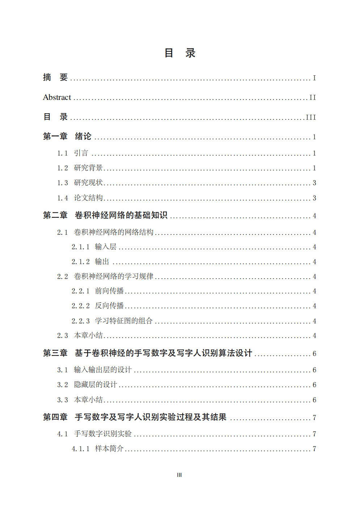
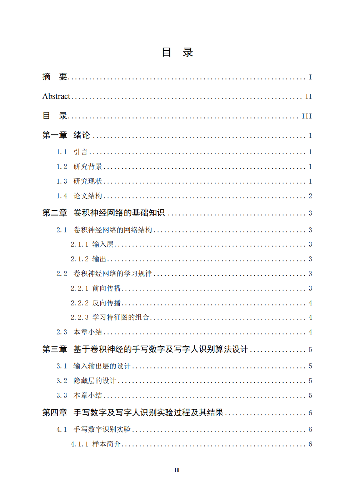

# SCUT-Latex-2026

**华南理工大学本科生毕业论文 LaTeX 模板（2026届适配版）。**

本项目基于 [ShevonKuan/SCUT-thesis](https://github.com/ShevonKuan/SCUT-thesis) 模板进行优化与适配。针对 2026 届毕业论文的排版要求，修正了字体、行距及目录样式等细节。

**效果对比：**

| LaTeX 输出 | Word 模板 |
|:---------:|:--------:|
|  |  |

---

## 📝 更新日志

### 2026/05/21
**1. 完善字体适配与细节排版**
- **适配 Windows 系统字体**：调用了 Windows 系统原生的中易宋体（`SimSun`）和中易黑体（`SimHei`），替代原有的 Adobe 开源字体，确保编译出的 PDF 字体与 Word 的一致。
- **修复摘要标点格式**：修复了摘要页“关键词”后的全角冒号字体。将其强制声明为宋体，解决了因字体差异导致的冒号位置偏中及间距异常问题。

**2. 优化目录（TOC）间距**
- 调整了 `chapter`、`section` 和 `subsection` 序号与标题文字之间的间距。

**3. 修复参考文献间距**
- 修正了参考文献列表中的条目行间距，使文献引用的排版更加规范、紧凑。

**4. 调整正文标题行距及排版说明**
- 优化了 `section`（节）、`subsection`（小节）与正文上下文之间的默认行间距。
- 💡 **排版提示**：如果在最终编译时，发现某页的章节标题与正文之间出现了异常变大的行间距，这通常是由于 LaTeX 处理大块图表浮动或页面强行对齐导致的。遇到此问题，建议通过增删段落字数、调整图表位置，或者在局部手动使用 `\vspace{}` 进行微调。

### 2026/05/01

**1. 参考文献作者格式优化**

修改项目 [gbt7714-bibtex-style](https://github.com/zepinglee/gbt7714-bibtex-style) 的 `bst` 文件，将第 67 行设置为 `#0`，即可将英文文献作者格式调整为符合毕设模板要求的显示风格。

**2. 去除文献类型中的双斜杠问题**

修改 `bst` 文件，调整了引用 `@inproceedings` 或 `@conference` 条目时， 参考文献出现 `//` 的问题，具体调整在第 214 行。

 **注意：** 如果在某一章（Chapter）中，某个 Section 内使用了 Subsection，需要手动添加间距微调命令：
> - 在**第一个** `\subsection` 之前添加：
>   ```latex
>   \addtocontents{toc}{\protect\vspace{-0.5pt}}
>   ```
> - 在**最后一个** `\subsection` 结束后、下一个 `\section` 之前也需要添加：
>   ```latex
>   \addtocontents{toc}{\protect\vspace{-0.5pt}}
>   ```
>
> 具体用法可参考 `docs/chap02.tex` 中的示例。

## 🚀 项目特点与优化

**精确行距：** 针对学校要求的 1.5 倍行距，通过 linespread=1.697 进行底层校准。

**结构清晰：** 优化了子文件管理，方便快速撰写正文。

**页眉页脚对齐：** 页眉页脚精确到模板**1个像素点内**。

## 📁 目录结构

```Plaintext
├── docs/               # 存放各章节正文 (.tex)
├── fonts/              # 字体文件夹
├── image/              # 论文插图存放路径
├── reference/          # 官方参考文献模板
├── main.tex            # 论文入口主文件
├── scutthesis.cls      # 模板类定义文件 (核心样式)
├── title.png           # 校名校徽 Logo
└── main.pdf            # 编译生成的预览文件
```
## 🛠️ 如何使用

本项目推荐使用在线编译工具，无需在本地配置繁琐的 LaTeX 环境。

1. 推荐工具：Texpage 或 Overleaf（推荐用Texpage，Overleaf免费版编译时间不够）。
2. 上传文件：将本项目所有文件打包上传至工具。
3. 编译器设置：XeLaTeX。

## ⚠️ 重点（关于 PDF 拼接）

由于开发者比较~~“懒”~~，**本项目并未对“封面页”和“学位论文原创性声明”的内部样式进行深度二次开发**。

**建议方案：**
	在论文撰写完成后，你可以使用学校提供的 Word 版封面和声明页，导出为 PDF，然后使用 PDF 软件（如 Adobe Acrobat 或在线工具）与本项目生成的正文 PDF 进行拼接。

## ⚖️ 免责声明与反馈

- **侵权联系：** 本项目仅供学习与学术交流使用。若内容涉嫌侵权，请立即通过邮件或 Issue 联系我，我将第一时间进行处理。
- **提交改进：** 如果你发现了排版 Bug，或者有更好的改进建议，欢迎提交 Issue。
- **风险自担：** 排版要求以各学院最终通知为准，提交前请务必对照学校指南仔细复核。

## 🎓祝大家顺利毕业！ 
